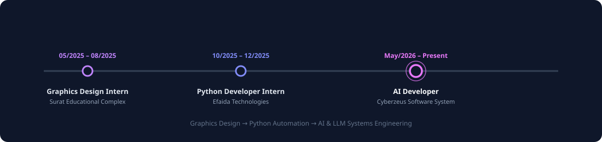

<!--
  PROFILE README
  Publish this from https://github.com/azqajafardev/azqajafardev
  (create a repo with the exact same name as your GitHub username)
  to display it on your GitHub profile Overview page.
  Keep the /assets folder in that same repo — the SVGs are loaded from ./assets/...
-->

<div align="center">



<br/>


<br/>

<a href="https://linkedin.com/in/azqa-jafar"></a>
<a href="mailto:azqajafar@gmail.com"></a>
<a href="https://github.com/azqajafardev"></a>


</div>

---

## 👩‍💻 About Me

I'm **Azqa Jafar**, a Software Engineering graduate (BS, CGPA 3.90/4.00) working as an **AI Developer** at Cyberzeus Software System. I build practical, production-facing AI systems — not just notebooks — spanning **agentic workflows, RAG pipelines, model training, and AI-powered backend services**.

I also bring a **graphic design and UI/UX background**, so the products I build tend to be as usable as they are intelligent.

```text
Currently building
├── Multi-agent AI systems (LangChain + LangGraph)
├── RAG pipelines with vector search & semantic retrieval
├── MCP-integrated agents talking to real tools & APIs
├── FastAPI / Flask backends for AI + ML services
└── AI-driven cybersecurity automation (scanning, threat analysis, reporting)
```

---

## 🧠 Core Practice

| Area | How I apply it |
| :--- | :--- |
| **Agentic AI** | Multi-agent orchestration, tool use, memory, and workflow automation with LangChain & LangGraph. |
| **LLM & RAG** | Embeddings, vector databases, semantic search, and knowledge-grounded question answering. |
| **Machine Learning / Deep Learning** | Model training, evaluation, and optimization with PyTorch & TensorFlow. |
| **AI Infrastructure** | MCP integration, FAISS, ChromaDB, and external API/tool orchestration for agents. |
| **Backend Engineering** | Python, FastAPI, Flask, REST APIs, PostgreSQL for AI/ML-powered services. |
| **Product & UI** | Flutter app development and UI/UX design, backed by an Adobe Creative Suite design background. |

---

## 🧭 Experience Timeline

<div align="center">
  
</div>

**AI Developer** · Cyberzeus Software System, Lahore *(May 2026 – Present)*
- Developed and integrated AI solutions using LLMs, RAG, and multi-agent systems
- Built AI agents and workflows with LangChain & LangGraph using APIs, tools, and memory
- Worked with embeddings, vector databases, and semantic search for intelligent retrieval
- Integrated MCP and external APIs so agents can interact with tools and services
- Built FastAPI/Flask backends connecting AI, ML, and frontend applications
- Contributed to AI-driven cybersecurity solutions: threat analysis, scanning, automated reporting

**Python Developer (Internship)** · Efaida Technologies, Okara *(Oct 2025 – Dec 2025)*
- Developed efficient Python scripts to automate data processing tasks

**Graphics Designing (Internship)** · Surat Educational Complex, Okara *(May 2025 – Aug 2025)*
- Used Adobe Creative Suite to produce high-quality graphics and layouts

---

## 🚀 Featured Projects

| Project | Stack | Highlights |
| :--- | :--- | :--- |
| **Enterprise AI Security Desktop Platform** | Python, FastAPI, LangChain, LangGraph, RAG, MCP, Vector DB, Flutter | Multi-agent desktop platform for intelligent scanning, threat analysis, vulnerability assessment, and role-based dashboards |
| **MPAFNet — 3D Multi-Plane Alzheimer's Classification** *(Final Year Project)* | Deep Learning, 3D Imaging | Custom MPAFNet architecture analyzing multi-plane brain imaging for early Alzheimer's detection |
| **CIFAR-10 Image Classification (EfficientNetB0)** | Python, TensorFlow | 89.63% accuracy in 5 epochs using transfer learning + fine-tuning on Kaggle GPU |
| **UniGuide AI — University Assistant** | Python, NLP, RAG, LangChain, Streamlit | Knowledge-grounded Q&A assistant for admissions, courses, fees, and university policies |
| **Deep Learning Architecture Diagrams** | Microsoft Visio | Detailed methodology diagrams for WTDNet, TabNet, and ConvNeXtNet for research papers |

---

## 🛠️ Tools & Technologies

<div align="center">

**AI & LLM**


**Machine Learning**


**AI Infrastructure**


**Backend & Development**


**Tools**


</div>

---

## 🕸️ Skills Network

<div align="center">
  
</div>

---

## 🎓 Education & Certifications

**BS Software Engineering** — University of Okara *(2022 – 2026)* · CGPA 3.90/4.00
**Intermediate (ICS – Physics)** — Punjab Group of Colleges *(2020 – 2022)* · 950/1100

- 📜 Advanced Graphics Designing — Surat Educational Complex *(Aug 2025)*
- 📜 Basics of Python — Uniathena *(Apr 2025)*
- 📜 Python for Beginners — Mindluster *(Mar 2025)*

---

## 📊 GitHub Activity

<div align="center">


</div>

---

## 🤝 Let's Connect

<div align="center">

<a href="https://linkedin.com/in/azqa-jafar"></a>
<a href="mailto:azqajafar@gmail.com"></a>
<a href="https://github.com/azqajafardev"></a>

<br/><br/>


</div>
