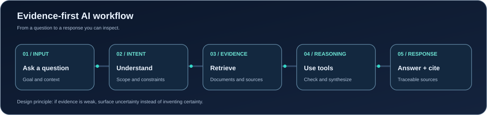

<!--
  GitHub profile README for azqajafardev.
  Push README.md, /assets, and .github/workflows/snake.yml (optional) to a repo
  named exactly "azqajafardev" (github.com/azqajafardev/azqajafardev).
-->

## About

AI Developer focused on building reliable, retrieval-grounded and agentic applications with Python, FastAPI, LangChain and current LLM tooling. I care less about a model's raw output and more about whether a system can be trusted — where an answer came from, why it was chosen, and what happens when there's no good answer to give.

- Building practical AI and generative AI applications end to end, not just prompt experiments
- Exploring AI agents, agentic RAG, and context-aware retrieval pipelines
- Developing backend APIs in Python and FastAPI to serve models and agents
- Working with document retrieval, embeddings, and vector databases (ChromaDB, FAISS, local embeddings)
- Applying deep learning to real classification problems, including 3D medical imaging
- Interested in reliability and explainability — systems that show their evidence instead of just asserting an answer
- Open to professional AI Developer roles and collaborations

> Currently an **AI Developer at Cyberzeus Software System** (Lahore) — building multi-agent AI workflows, RAG pipelines, and FastAPI backends for AI-driven cybersecurity tooling.

## Core Expertise

<table>
<tr>
<td width="50%" valign="top">

### 🤖 AI Agents & LLM Systems
- Multi-agent workflows with LangChain and LangGraph
- Tool use, memory, and MCP-based agent-to-tool communication
- LLM integration across OpenAI, Gemini, Hugging Face, and Ollama

</td>
<td width="50%" valign="top">

### 🔎 Retrieval & Vector Search
- Agentic and classic RAG pipelines with source citations
- Embeddings and semantic search with FAISS and ChromaDB
- Context engineering — chunking, metadata, retrieval thresholds

</td>
</tr>
<tr>
<td width="50%" valign="top">

### ⚙️ Backend & APIs
- FastAPI and Flask services for AI and ML products
- REST API design with PostgreSQL and SQLAlchemy
- Role-based dashboards and plugin-style architectures

</td>
<td width="50%" valign="top">

### 🧠 Applied ML & Computer Vision
- Deep learning model design and training in PyTorch and TensorFlow
- 3D multi-plane medical image classification (MPAFNet)
- Transfer learning, fine-tuning, and model evaluation

</td>
</tr>
</table>

## Technology Stack

**Core Development**

**Machine Learning & Applications**

**AI & LLM Frameworks**

## Experience

| Role | Organization | Duration | Focus |
| :--- | :--- | :--- | :--- |
| **AI Developer** | Cyberzeus Software System, Lahore | May 2026 – Present | Multi-agent AI workflows, RAG pipelines, FastAPI backends, AI-driven cybersecurity tooling |
| **Python Developer** (Internship) | Efaida Technologies, Okara | Oct 2025 – Dec 2025 | Automated data-processing scripts |

**Education:** BS Software Engineering, University of Okara — CGPA 3.90/4.00 (2022 – 2026)

## Selected Work

| Project | Stack | Highlight |
| :--- | :--- | :--- |
| **[EvidenceRAG — Agentic RAG Research Assistant](https://github.com/azqajafardev/agentic-rag-research-assistant)** | Python, FastAPI, React, ChromaDB, local ONNX embeddings, Claude/Groq LLM APIs | Answers questions from research papers with page-aware citations. The LLM is never called when retrieval finds no supporting evidence, so it can't fabricate a source. Covered by a 35-test suite. |
| **Enterprise AI Security Desktop Platform** | Python, FastAPI, LangChain, LangGraph, RAG, MCP, Flutter, Dart | Multi-agent desktop platform for intelligent scanning, vulnerability assessment, and automated reporting, with role-based dashboards and a dynamic plugin architecture. |
| **3D Multi-Plane Alzheimer's Classification (MPAFNet)** | Python, PyTorch, Deep Learning | Final-year research project: a custom architecture analyzing multiple 3D brain-imaging planes for early Alzheimer's detection, using transfer learning to improve accuracy. |
| **UniGuide AI — University Assistant** | Python, NLP, LangChain, RAG, Streamlit | Knowledge-grounded Q&A assistant answering student queries on admissions, departments, courses, fees, and university policy. |

*More projects are added here as they're published to GitHub.*

## How My AI Systems Think

I design AI workflows that combine retrieval, structured reasoning, tool use, and source-aware responses — so an answer is something you can check, not just something you have to trust.

## GitHub Activity

A quick look at how consistently I ship — commits, streaks, and the languages I reach for most.

<!--
  Contribution snake (optional): .github/workflows/snake.yml generates these on a
  schedule using the Platane/snk action and publishes them to an "output" branch.
  Uncomment once that workflow has run at least once.

-->

## Development Philosophy

| Build for real problems | Make answers traceable | Combine reasoning with clean engineering |
| :--- | :--- | :--- |
| I'd rather ship something narrow that actually works than a broad demo that doesn't. | An AI answer should point back to where it came from, not just sound confident. | A good agent still needs a well-structured API, tests, and error handling around it. |

## Let's Connect

