<!--
  PROFILE README
  Publish this from https://github.com/Hamza-code-hub/Hamza-code-hub
  to display it on the GitHub profile Overview page.
-->

  &nbsp;
  &nbsp;
  &nbsp;
  &nbsp;
  &nbsp;
  &nbsp;
  &nbsp;
  

  

  
  

## Building useful intelligence

I am Muhammad Hamza, an AI engineer and applied AI researcher based in Pakistan. I completed a Bachelor of Science in Software Engineering at the University of Okara in 2026. My work sits where strong models meet dependable software: agentic systems, retrieval, computer vision, and the engineering needed to put them to work.

### What I optimize for

- Grounded, tool-using AI workflows rather than demos that stop at a prompt.
- Computer-vision systems that turn raw video into operational decisions.
- Reproducible experimentation, measurable evaluation, and maintainable delivery.

## Core practice

| Area | How I apply it |
| :--- | :--- |
| **Agentic AI** | Multi-agent orchestration, stateful workflows, tool use, MCP, and AI automation. |
| **LLM and RAG** | Retrieval design, embeddings, semantic search, knowledge assistants, and evaluation. |
| **Computer vision** | Detection, tracking, spatial reasoning, motion analysis, and real-time video intelligence. |
| **Applied ML** | Data preparation, feature engineering, model evaluation, and decision-ready analytics. |
| **AI delivery** | Python APIs, backend services, containers, CI/CD, observability, and cloud deployment. |

## Selected work

  

| System | Focus | Explore |
| :--- | :--- | :---: |
| **VisionGuard AI** | Warehouse video safety intelligence: detection, tracking, motion, TTC, risk, and explainable events. | [Case study](https://hamza-code-hub.github.io/projects/visionguard-ai.html) |
| **NeuroInsight AI** | Clinical intelligence combining 3D neuroimaging, explainability, biomarkers, RAG, and reporting. | [Case study](https://hamza-code-hub.github.io/projects/neuroinsight-ai.html) |
| **Agentic Cybersecurity Assistant** | Multi-agent vulnerability triage, security retrieval, scheduled scans, and reporting. | [Case study](https://hamza-code-hub.github.io/projects/agentic-cybersecurity-ai-assistant.html) |
| **Agentic RAG Support Assistant** | Knowledge-grounded technical support with autonomous reasoning and retrieval. | [Case study](https://hamza-code-hub.github.io/projects/agentic-rag-support-assistant.html) |
| **AeroRUL AI** | Aircraft-engine remaining-useful-life prediction and operational analytics. | [Case study](https://hamza-code-hub.github.io/projects/aircraft-engine-rul-prediction.html) |

## Tools I reach for

 

  

## Live engineering signal

 

## Research and contact

My research interests include 3D data modelling, medical imaging, deep learning, and practical AI systems. I bring the same approach to research and engineering: frame the problem clearly, make experiments reproducible, measure outcomes honestly, and build the surrounding software that makes the result useful.

  &nbsp;
  &nbsp;
  &nbsp;
  &nbsp;
  &nbsp;
  &nbsp;
  &nbsp;
  

